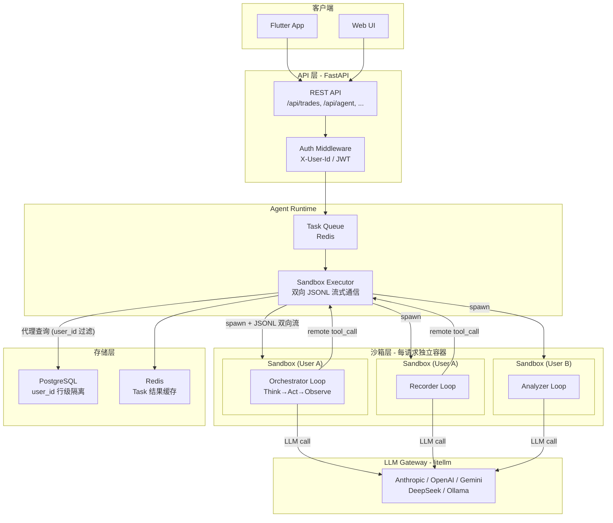
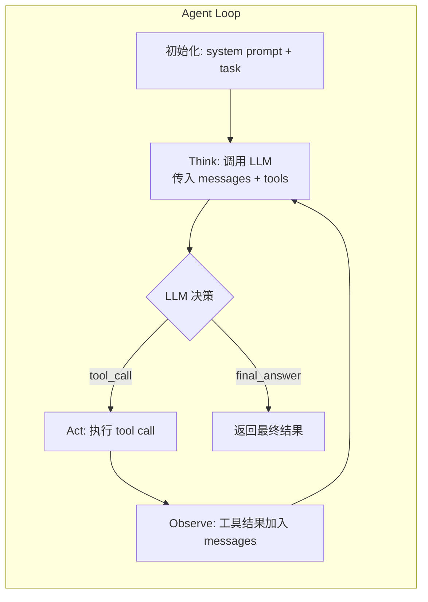
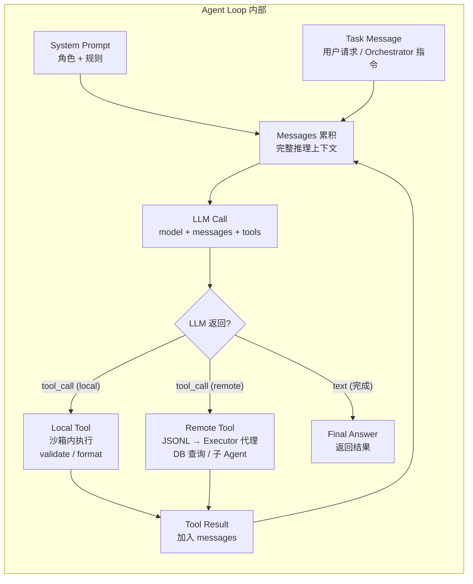
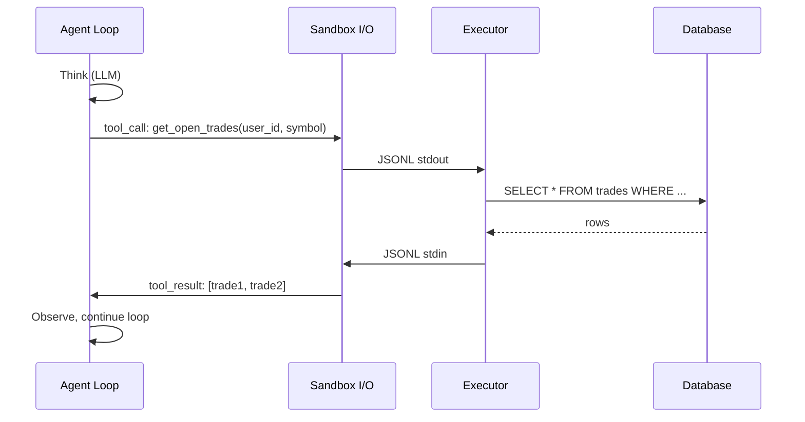
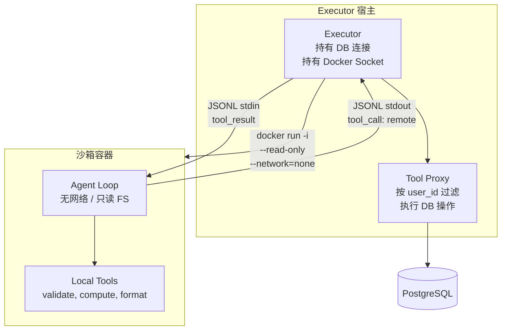
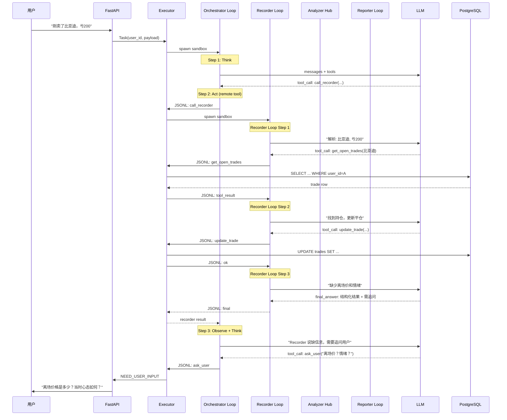
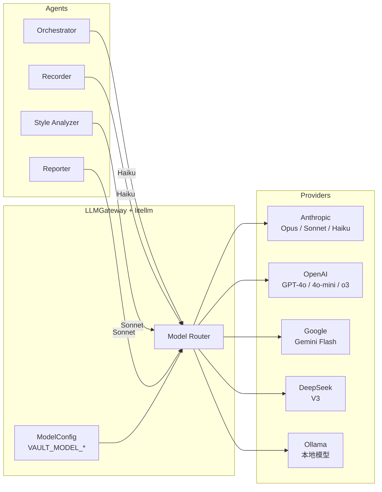

# Agent Loop 架构设计

> 将一次性进程式的 Agent 重构为真正的 Loop 架构：每个 Agent 内部是 perceive-think-act-observe 循环，由 LLM 驱动工具调用和多步推理，Executor 通过双向流式通信代理数据访问。

---

## 一、系统全景架构



---

## 二、核心 Loop 模型

真正的 Agent 应该是一个 **loop**，每轮循环中自主决定下一步动作（调用工具、继续推理、返回结果），直到任务完成。



每个 Agent 的一次运行 = 一个 loop，可能经历多轮 `Think → Act → Observe`。

### Agent 内部详细流程



---

## 三、BaseAgent 抽象

所有 Agent 共用的 loop 骨架，放在 `backend/agents/base.py`：

```python
class BaseAgent:
    name: str
    system_prompt: str
    tools: list[Tool]           # 该 agent 可用的工具
    max_steps: int = 15         # 防止死循环
    llm_model: str = "gpt-4o-mini"

    def run(self, task: AgentTask) -> AgentResult:
        messages = [
            {"role": "system", "content": self.system_prompt},
            {"role": "user", "content": self.format_task(task)},
        ]
        for step in range(self.max_steps):
            response = self.llm_call(messages, tools=self.tools)

            if response.has_tool_calls():
                for tc in response.tool_calls:
                    tool_result = self.execute_tool(tc.name, tc.arguments)
                    messages.append(assistant_msg(response))
                    messages.append(tool_result_msg(tc.id, tool_result))

            elif response.has_final_answer():
                return AgentResult(success=True, result=response.content)

        return AgentResult(success=False, error="max steps reached")
```

关键点：

- LLM 是 loop 的"大脑"，每轮决定调用工具还是给出最终答案
- Tools 是 Agent 的"手脚"，通过 function calling 协议暴露
- Messages 累积对话历史，Agent 有完整的推理上下文

---

## 四、每个 Agent 的 Tools 定义

### 4.1 Orchestrator Agent

| Tool | 作用 |
|------|------|
| `call_recorder` | 调用 Recorder Agent 完成记录任务 |
| `call_analyzer` | 调用 Analyzer Hub 执行分析 |
| `call_reporter` | 调用 Reporter Agent 生成报告 |
| `query_trades` | 直接查询交易（简单查询不需要 Agent） |
| `ask_user` | 向用户追问（返回 NEED_USER_INPUT） |

Orchestrator 的 loop 典型流程：

```
Think: "用户要做周度复盘" → Act: call_analyzer(weekly, range)
Observe: 分析结果 → Think: "拿到分析，需要生成报告" → Act: call_reporter(analysis)
Observe: 报告 → Think: "完成" → Final: 返回报告给用户
```

### 4.2 Recorder Agent

| Tool | 作用 |
|------|------|
| `create_trade` | 创建新交易记录 |
| `update_trade` | 更新已有交易 |
| `get_open_trades` | 查询持仓（关联平仓） |
| `search_trades` | 查询历史（去重） |
| `validate_trade` | 校验字段完整性 |

Recorder 的 loop 典型流程：

```
Think: "用户说买了比亚迪，提取关键信息" → 推理出 symbol, direction, price
Think: "缺少 entry_time 和 position_pct" → Act: validate_trade(partial_data)
Observe: 校验结果 → Think: "必填字段缺失，需要补全。先查有没有重复"
    → Act: search_trades(symbol=比亚迪, today)
Observe: 无重复 → Think: "用默认值补全时间，返回确认给 Orchestrator"
    → Final: 返回结构化记录 + 需追问的字段
```

### 4.3 Analyzer Hub（不是 LLM Agent，是代码逻辑）

Analyzer Hub 本身是纯代码路由，但调用的 **Style Analyzer 可以是 LLM Agent**（用于模式解读）。

- Base Analyzer = 纯代码计算（不需要 loop）
- Style Analyzer = 代码计算 + LLM 解读（可选 loop）

### 4.4 Reporter Agent

| Tool | 作用 |
|------|------|
| `get_previous_report` | 获取上期报告（用于对比） |
| `get_analysis_result` | 获取本期分析结果 |
| `format_markdown` | 输出最终 markdown |

Reporter 的 loop 典型流程：

```
Think: "需要写周度报告，先获取数据" → Act: get_analysis_result(id)
Observe: 分析数据 → Think: "需要和上周对比" → Act: get_previous_report(weekly)
Observe: 上周数据 → Think: "开始撰写报告"
    → Final: 输出完整 markdown 报告
```

---

## 五、Tool 与沙箱的关系

Agent 在沙箱内运行，**没有 DB 访问**。通过 Tool Proxy（工具代理）解决数据访问：



- Agent 沙箱内 stdout/stdin 是 **JSONL 双向流**，不是一次性 I/O
- Agent 发出 tool_call → Executor 拦截 → 执行（查 DB / 调用子 Agent） → 注入结果
- Agent 无网络、无 DB，所有外部访问都通过 Executor 代理

Tool 分两类：

- **Local tools**：纯计算，在沙箱内执行（如 validate_trade、format_markdown）
- **Remote tools**：需要外部资源，由 Executor 代理执行（如 create_trade、get_open_trades）

### 沙箱隔离与工具代理



---

## 六、Orchestrator 编排子 Agent 流程



---

## 七、LLM 集成（多模型支持）

### 7.1 支持的模型

通过 [litellm](https://docs.litellm.ai/) 统一接口，支持以下主流模型（用户可在配置中自由切换）：

| Provider | 模型 | litellm model 标识 | 适用场景 |
|----------|------|-------------------|---------|
| Anthropic | Claude Opus 4 | `anthropic/claude-opus-4` | 深度推理、复杂分析 |
| Anthropic | Claude Sonnet 4 | `anthropic/claude-sonnet-4-20250514` | 报告生成、模式解读 |
| Anthropic | Claude Haiku | `anthropic/claude-3-5-haiku-20241022` | 快速路由、简单提取 |
| OpenAI | GPT-4o | `openai/gpt-4o` | 深度分析、报告 |
| OpenAI | GPT-4o-mini | `openai/gpt-4o-mini` | 意图识别、NLU |
| OpenAI | o3-mini | `openai/o3-mini` | 推理密集型任务 |
| Google | Gemini 2.0 Flash | `gemini/gemini-2.0-flash` | 低成本、高速度 |
| DeepSeek | DeepSeek-V3 | `deepseek/deepseek-chat` | 低成本替代 |
| 本地 | Ollama 模型 | `ollama/qwen2.5` | 离线 / 隐私场景 |

### 7.2 配置方式

环境变量配置 API Keys：

```bash
# .env
ANTHROPIC_API_KEY=sk-ant-...
OPENAI_API_KEY=sk-...
GEMINI_API_KEY=...
DEEPSEEK_API_KEY=...
```

每个 Agent 可独立指定模型，通过 `backend/agents/llm.py` 中的 `ModelConfig`：

```python
@dataclass
class ModelConfig:
    """Per-agent model assignment. User-configurable."""
    orchestrator: str = "anthropic/claude-3-5-haiku-20241022"
    recorder: str = "anthropic/claude-3-5-haiku-20241022"
    analyzer_interpret: str = "anthropic/claude-sonnet-4-20250514"
    reporter: str = "anthropic/claude-sonnet-4-20250514"

    @classmethod
    def from_env(cls) -> "ModelConfig":
        """Override per-agent model via env: VAULT_MODEL_ORCHESTRATOR=openai/gpt-4o-mini"""
        ...
```

### 7.3 LLM 调用封装

```python
import litellm

class LLMGateway:
    def __init__(self, config: ModelConfig):
        self.config = config

    def call(self, model: str, messages: list, tools: list | None = None) -> LLMResponse:
        response = litellm.completion(
            model=model,
            messages=messages,
            tools=[t.to_openai_schema() for t in tools] if tools else None,
            tool_choice="auto" if tools else None,
        )
        return LLMResponse.from_litellm(response)
```

litellm 会自动处理不同 provider 的 tool_call 格式差异（OpenAI function calling vs Anthropic tool_use）。

### 7.4 多模型路由



### 7.5 各 Agent 默认模型建议

| Agent | 需求 | 默认模型 | 可替换为 |
|-------|------|---------|---------|
| Orchestrator | 意图识别、路由 | Claude Haiku | GPT-4o-mini, Gemini Flash |
| Recorder | NLU 提取、结构化 | Claude Haiku | GPT-4o-mini, DeepSeek |
| Style Analyzer 解读 | 深度模式分析 | Claude Sonnet | GPT-4o, Claude Opus |
| Reporter | 长文报告撰写 | Claude Sonnet | GPT-4o, Claude Opus |

用户可通过环境变量 `VAULT_MODEL_*` 覆盖任意 Agent 的模型选择，无需改代码。

---

## 八、目录结构

```
backend/agents/
    __init__.py
    base.py                    # BaseAgent loop + Tool 基类
    tools.py                   # Tool 注册表 + local/remote 标识
    llm.py                     # LLMGateway + ModelConfig (litellm 封装)
    prompts/                   # System prompts
        orchestrator.py
        recorder.py
        reporter.py
        analyzer.py
    orchestrator/
        __init__.py
        agent.py               # OrchestratorAgent(BaseAgent)
        tools.py               # call_recorder, call_analyzer, ask_user...
    recorder/
        __init__.py
        agent.py               # RecorderAgent(BaseAgent)
        tools.py               # create_trade, update_trade, validate...
    analyzer/
        __init__.py
        hub.py                 # AnalyzerHub (纯代码路由，非 LLM Agent)
        base.py                # BaseAnalyzer (纯代码计算)
        styles/
            __init__.py
            technical.py       # 代码计算 + 可选 LLM 解读
            value.py
            trend.py
            short_term.py
    reporter/
        __init__.py
        agent.py               # ReporterAgent(BaseAgent)
        tools.py               # get_previous_report, format_markdown...
```

---

## 九、Executor 改造

`backend/agent_runtime/executor.py` 改为**双向流式通信**：

当前：`subprocess.run(input=..., capture_output=True)` 一次性交互
改为：`subprocess.Popen` 保持 stdin/stdout 打开，按 JSONL 协议逐行交互

```
Executor 启动容器 (docker run -i)
    while True:
        line = container.stdout.readline()  # Agent 的输出
        msg = parse_jsonl(line)
        if msg.type == "tool_call":
            result = proxy_tool(msg)        # 代理执行
            container.stdin.write(jsonl(result))
        elif msg.type == "final":
            return msg.result               # Agent 完成
        elif msg.type == "error":
            return error
```

---

## 十、MVP 实现优先级

| 阶段 | 内容 |
|------|------|
| 1 | 实现 `BaseAgent` loop + `Tool` 基类 + `llm.py` 封装 |
| 2 | 实现 RecorderAgent（最简单的 Agent，2-3 个 tools） |
| 3 | 改造 Executor 为双向 JSONL 流式通信 |
| 4 | 实现 OrchestratorAgent（能调用 RecorderAgent） |
| 5 | AnalyzerHub (纯代码) + BaseAnalyzer (纯代码) |
| 6 | ReporterAgent |
| 7 | Style Analyzer plugins |
