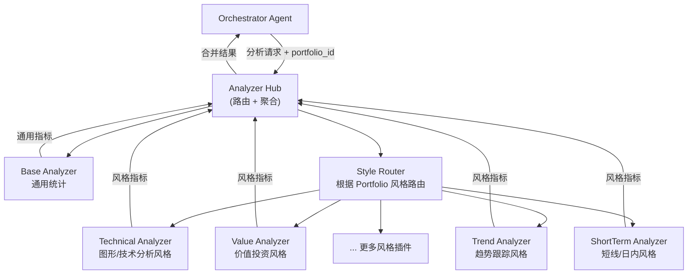

# Analyzer Agent 细分方案

> 将当前单体 Analyzer Agent 重构为「Base + 插件化风格分析器」架构，每个 Portfolio 绑定交易风格，系统自动路由到对应的 Style Analyzer。

## 核心思路

将原来的单体 Analyzer 拆分为 **1 个 Base Analyzer + N 个 Style Analyzer 插件**，通过 Portfolio（账户/组合）绑定交易风格来自动路由。

## 新的 Analyzer 架构



## 各 Analyzer 职责

### 1. Analyzer Hub（分析路由/聚合层）

不是独立 Agent，而是 Analyzer 模块的入口。职责：

- 接收 Orchestrator 的分析请求
- 查询 Portfolio 绑定的交易风格
- **始终调用** Base Analyzer
- **按风格路由到** 对应的 Style Analyzer
- 合并两者结果后返回

### 2. Base Analyzer（通用统计分析 —— 所有风格共享）

无论什么交易风格都需要的通用指标：

- 胜率、盈亏比、期望收益
- 最大单笔亏损、最大连续亏损
- 资金曲线（权益曲线）
- 资金管理一致性（每笔风险敞口是否遵守规则）
- 3M 中 **Mind** 维度：情绪标签分布、纪律违反频率
- 3M 中 **Money** 维度：仓位合规率、止损执行率

### 3. Technical Analyzer（图形/技术分析风格）

针对使用均线、形态、指标信号做决策的交易者：

- **信号一致性**：进出场是否基于预设信号？还是临时起意？
- **指标使用稳定性**：是否频繁换指标？每笔交易用的指标组合是否一致？
- **时间框架一致性**：是否在预设的时间框架上决策？
- **形态识别复盘**：标记的形态（如头肩顶、双底）事后验证准确率
- 3M 中 **Method** 维度侧重：系统信号遵守度

### 4. Value Analyzer（价值投资风格）

针对基于基本面、估值逻辑做决策的交易者：

- **持仓周期分析**：平均持有时间，是否因短期波动过早离场
- **买入逻辑追踪**：当初买入理由是否仍然成立（基本面论据）
- **安全边际回顾**：买入价 vs 当时估算的内在价值
- **耐心指标**：浮亏期间是否恐慌卖出？浮盈期间是否过早兑现？
- 3M 中 **Method** 维度侧重：基本面论据的质量与事后验证

### 5. Trend Analyzer（趋势跟踪风格）

针对顺势而为、动量策略的交易者：

- **趋势识别准确率**：你判断的趋势方向事后是否正确
- **持仓耐力**：趋势延续时是否过早离场（利润截短）
- **止损纪律**：趋势反转时是否及时止损（亏损放大）
- **加仓合理性**：顺势加仓的时机和仓位是否合理
- 3M 中 **Method** 维度侧重：「让利润奔跑、截断亏损」的执行度

### 6. ShortTerm Analyzer（短线/日内交易风格）

针对盘口、分时、快进快出的交易者：

- **过度交易检测**：日交易频次是否异常、是否因亏损后报复性交易
- **执行效率**：进出场滑点、计划价位 vs 实际价位偏差
- **时段分析**：盈利集中在哪些时段？亏损集中在哪些时段？
- **风险暴露**：单日最大亏损、是否触发日内止损线
- 3M 中 **Method** 维度侧重：执行纪律和情绪管控（短线更易受情绪影响）

## Portfolio 与风格的绑定

数据模型新增 Portfolio 概念：

```python
class Portfolio:
    id: str
    name: str              # "A股主账户"、"期货趋势账户"
    trading_style: str     # "technical" | "value" | "trend" | "short_term"
    description: str
```

每笔交易记录关联到一个 Portfolio，分析时自动路由。

## 插件化扩展机制

每个 Style Analyzer 遵循统一接口：

```python
class StyleAnalyzer(Protocol):
    style_name: str

    def analyze_single(self, trade, context) -> StyleAnalysisResult:
        """单笔交易的风格维度分析"""

    def analyze_batch(self, trades, period) -> StyleBatchResult:
        """批量交易的风格维度统计与模式识别"""

    def get_method_diagnosis(self, trades) -> MethodDiagnosis:
        """3M 中 Method 维度的风格特定诊断"""
```

新增风格只需实现此接口并注册，无需改动 Analyzer Hub 或 Orchestrator。

## 对 PROJECT_DESIGN 的影响

本方案对 [PROJECT_DESIGN.md](PROJECT_DESIGN.md) 的关联更新：

- **三、Agent 架构设计** —— 3.1 架构图中 Analyzer 展开为 Hub + Base + Style 插件
- **3.2 Analyzer Agent 职责详解** —— 替换为上述 6 个组件的说明
- **3.3 沟通流程** —— 流程 2/3 中 Analyzer 步骤需体现路由逻辑
- **2.2 数据结构化** —— 新增 Portfolio 概念和风格绑定
- **六、MVP 功能优先级** —— 标注 MVP 先实现 Base + 1-2 个 Style Analyzer

## MVP 策略

| 优先级 | 组件 | 说明 |
|--------|------|------|
| P0 | Base Analyzer | 必须有，所有风格共享 |
| P0 | Technical Analyzer | 最通用，覆盖面广 |
| P1 | Trend Analyzer | 第二常见风格，与 Technical 侧重不同 |
| P2 | Value Analyzer | 价值投资风格 |
| P2 | ShortTerm Analyzer | 短线/日内风格 |
| 后续 | 用户自定义风格插件 | 支持扩展 |
