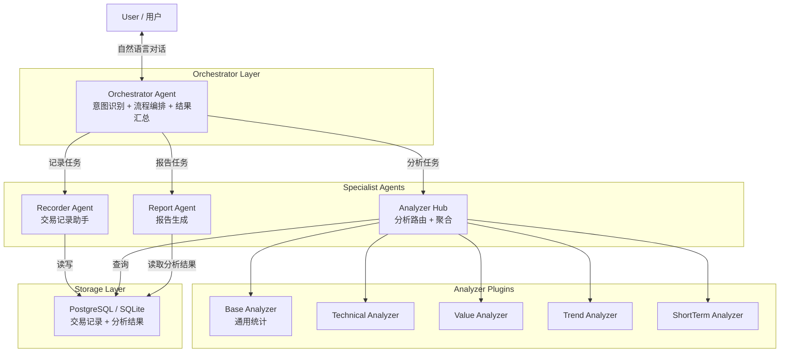
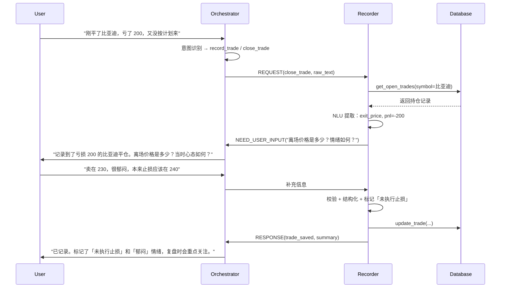
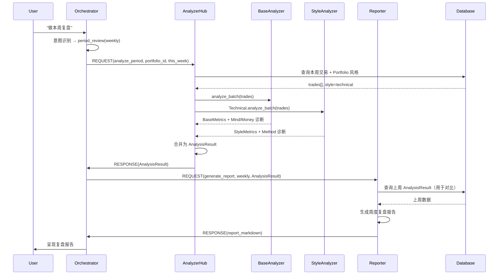
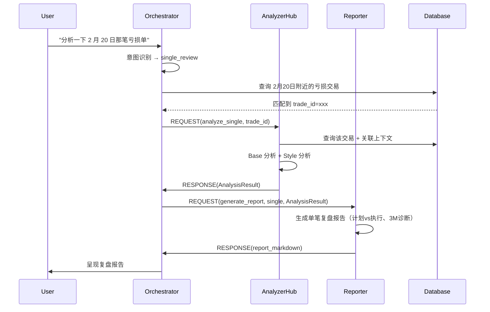
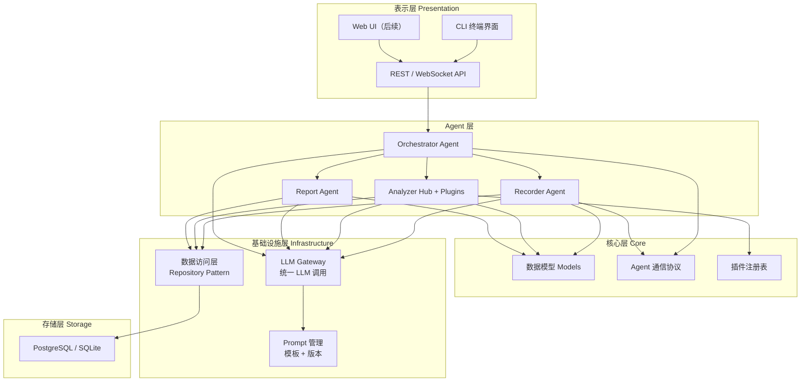
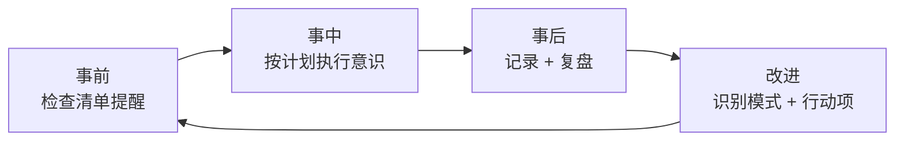

# Vault 交易日志系统 - 项目设计规划

> 「优秀的交易者做优秀的交易记录。他们保持交易记录不仅仅是为了他们的账户，而是为了学习和纪律性。」
> —— 亚历山大·埃尔德，《走进我的交易室》

---

## 一、项目定位

**Vault** 是一款基于埃尔德《走进我的交易室》指导原则、结合 AI Agent 技术的**交易日志与复盘辅助系统**。

### 1.1 核心原则（埃尔德 3M 框架）

| 支柱 | 含义 | 在 Vault 中的落地 |
|------|------|-------------------|
| **Mind 心智** | 交易心理、纪律、情绪管理 | 主观记录：心态变化、情绪标签、进出场理由的自我评估；复盘时诊断是否为情绪驱动决策 |
| **Method 方法** | 分析系统、决策程序 | 策略一致性检查、信号执行评估；按交易风格（技术/价值/趋势/短线）做差异化诊断 |
| **Money 资金** | 资金管理、风险控制 | 仓位规模合规性、止损执行率、单笔/总体风险敞口、盈亏比统计 |

### 1.2 设计约束

- **不做任何预测**：不涉及价格预测、买卖建议、市场方向判断
- **只做记录、归纳、反思辅助**：帮助用户从历史交易中学习
- **不触碰真实交易**：系统不连接券商/交易所，不下单、不自动执行

### 1.3 目标用户画像

| 特征 | 描述 |
|------|------|
| 身份 | 个人交易者（散户/半职业） |
| 市场 | A 股、港股、美股、期货、加密货币等 |
| 交易风格 | 技术分析、价值投资、趋势跟踪、短线/日内，或多种风格并用 |
| 痛点 | 交易后缺乏系统性复盘，重复同样的错误，缺乏纪律性追踪 |
| 需求 | 低摩擦地记录交易、获得有洞察力的复盘报告、逐步改善交易纪律 |

---

## 二、核心功能模块

### 2.1 交易记录（输入层）

基于书中「交易记录比任何指标都重要」的理念，每笔交易记录分为客观信息和主观信息两部分。

#### 客观信息

| 字段 | 说明 | 是否必填 |
|------|------|----------|
| portfolio_id | 所属组合/账户 | 必填 |
| symbol | 交易品种（如 AAPL、沪深300期货） | 必填 |
| market | 市场（A股/港股/美股/期货/加密货币） | 必填 |
| direction | 多/空 | 必填 |
| position_size | 仓位规模（股数/手数/金额） | 必填 |
| entry_time | 开仓时间 | 必填 |
| entry_price | 开仓价格 | 必填 |
| exit_time | 平仓时间 | 平仓后必填 |
| exit_price | 平仓价格 | 平仓后必填 |
| stop_loss | 止损价位 | 选填 |
| take_profit | 止盈/目标价位 | 选填 |
| pnl | 盈亏金额 | 自动计算 |
| pnl_percent | 盈亏百分比 | 自动计算 |
| commission | 佣金/手续费 | 选填 |
| risk_reward_ratio | 风险回报比 | 自动计算（需止损和止盈） |

#### 主观信息

| 字段 | 说明 | 是否必填 |
|------|------|----------|
| entry_reason | 进场理由（策略/信号/逻辑描述） | 必填 |
| exit_reason | 离场理由 | 平仓后必填 |
| pre_trade_plan | 盘前/交易前计划 | 选填 |
| plan_deviation | 计划 vs 实际执行的偏差描述 | 选填 |
| emotion_tags | 情绪标签（冷静/焦虑/贪婪/恐惧/冲动/兴奋） | 选填（多选） |
| mood_narrative | 交易过程中的心态变化叙述 | 选填 |
| self_rating | 自我评分（1-5，执行质量而非盈亏） | 选填 |
| lessons | 本笔交易的教训/收获 | 选填 |
| tags | 自定义标签（如「追涨」「左侧交易」「财报博弈」） | 选填 |

#### 录入方式

| 方式 | 描述 | 优先级 |
|------|------|--------|
| 自然语言录入 | 用户用口语描述，Recorder Agent 解析并引导补全 | P0 |
| 结构化表单 | Web/CLI 表单逐字段填写 | P0 |
| 截图/图片输入 | 上传交易截图，OCR + LLM 提取信息 | P2 |
| 批量导入 | CSV/Excel 导入历史交易数据 | P1 |

### 2.2 数据结构化（存储层）

#### Portfolio 模型

每个用户可拥有多个 Portfolio，每个 Portfolio 绑定一种主要交易风格：

```python
@dataclass
class Portfolio:
    id: str                     # UUID
    user_id: str
    name: str                   # "A股技术交易"、"BTC趋势账户"
    trading_style: TradingStyle # 枚举：TECHNICAL / VALUE / TREND / SHORT_TERM
    market: str                 # 主要市场
    description: str
    risk_rules: RiskRules       # 该组合的资金管理规则
    created_at: datetime
    updated_at: datetime

@dataclass
class RiskRules:
    max_single_risk_pct: float  # 单笔最大风险占总资金百分比（如 2%）
    max_daily_loss: float       # 日最大亏损额度
    max_position_pct: float     # 单笔最大仓位占比
    max_open_positions: int     # 最大同时持仓数

class TradingStyle(Enum):
    TECHNICAL = "technical"
    VALUE = "value"
    TREND = "trend"
    SHORT_TERM = "short_term"
```

#### Trade 模型

```python
@dataclass
class Trade:
    id: str                     # UUID
    portfolio_id: str           # 关联 Portfolio
    status: TradeStatus         # OPEN / CLOSED

    # 客观信息
    symbol: str
    market: str
    direction: Direction        # LONG / SHORT
    position_size: float
    entry_time: datetime
    entry_price: float
    exit_time: Optional[datetime]
    exit_price: Optional[float]
    stop_loss: Optional[float]
    take_profit: Optional[float]
    pnl: Optional[float]
    pnl_percent: Optional[float]
    commission: Optional[float]
    risk_reward_ratio: Optional[float]

    # 主观信息
    entry_reason: str
    exit_reason: Optional[str]
    pre_trade_plan: Optional[str]
    plan_deviation: Optional[str]
    emotion_tags: list[EmotionTag]
    mood_narrative: Optional[str]
    self_rating: Optional[int]  # 1-5
    lessons: Optional[str]
    tags: list[str]

    # 元数据
    created_at: datetime
    updated_at: datetime

class EmotionTag(Enum):
    CALM = "calm"
    ANXIOUS = "anxious"
    GREEDY = "greedy"
    FEARFUL = "fearful"
    IMPULSIVE = "impulsive"
    EXCITED = "excited"
    REVENGE = "revenge"         # 报复性交易
    FOMO = "fomo"
```

#### 分析结果模型

```python
@dataclass
class AnalysisResult:
    id: str
    portfolio_id: str
    analysis_type: str          # "single" / "weekly" / "monthly" / "custom"
    period_start: datetime
    period_end: datetime
    trade_ids: list[str]        # 本次分析涵盖的交易

    base_metrics: BaseMetrics
    style_metrics: Optional[StyleMetrics]  # 风格特定指标
    mind_diagnosis: MindDiagnosis
    method_diagnosis: MethodDiagnosis
    money_diagnosis: MoneyDiagnosis

    created_at: datetime

@dataclass
class BaseMetrics:
    total_trades: int
    win_rate: float
    avg_pnl: float
    profit_factor: float        # 总盈利 / 总亏损
    max_single_loss: float
    max_consecutive_losses: int
    avg_risk_reward: float
    expectancy: float           # 期望收益 = 胜率 × 平均盈利 - 败率 × 平均亏损
    sharpe_ratio: Optional[float]
```

### 2.3 复盘分析（分析层）

分析层采用 **Base + Style Plugin** 架构，详见第三章 Analyzer 部分。

| 分析类型 | 说明 | 触发方式 |
|----------|------|----------|
| 单笔复盘 | 针对某笔具体交易的决策评估、执行偏差、3M 诊断 | 用户指定 |
| 日度快照 | 当日交易汇总 + 纪律合规检查 | 自动/用户触发 |
| 周度复盘 | 本周统计、模式识别、改进清单 | 自动提醒 + 用户触发 |
| 月度复盘 | 月度趋势、深度模式分析、目标达成度 | 用户触发 |
| 自定义分析 | 按品种/标签/时间范围的自由筛选分析 | 用户触发 |

### 2.4 洞察输出（输出层）

| 产出 | 说明 | 格式 |
|------|------|------|
| 复盘报告 | 数据摘要 + 3M 诊断 + 改进建议 | Markdown / HTML |
| 问题清单 | 重复性错误列表、纪律违反项 | 结构化列表 |
| 改进追踪 | 上期问题的改善/恶化对比 | 前后对比表 |
| 交易前检查项 | 基于历史问题生成的「开仓前 Checklist」 | 结构化列表 |
| 权益曲线 | 资金增长/回撤可视化 | 图表（后续） |

---

## 三、Agent 架构设计

### 3.1 总体架构



### 3.2 各 Agent 职责详解

#### 3.2.1 Orchestrator Agent（协调者）

| 维度 | 说明 |
|------|------|
| **核心职责** | 理解用户自然语言意图，决定调用哪些 Agent，编排执行顺序，汇总并呈现最终结果 |
| **输入** | 用户的自然语言指令 |
| **输出** | 对用户的最终响应（文字/报告/确认） |
| **决策逻辑** | 意图分类 → 路由到对应 Agent → 收集结果 → 组织输出 |

**意图分类体系：**

| 意图类型 | 示例 | 路由 |
|----------|------|------|
| `record_trade` | "记一笔，今天买了比亚迪" | Recorder |
| `close_trade` | "比亚迪卖了，赚了 500" | Recorder（更新已有记录） |
| `single_review` | "分析一下那笔亏损单" | Analyzer → Reporter |
| `period_review` | "做本周复盘" | Analyzer → Reporter |
| `query_stats` | "我这个月胜率多少" | Analyzer |
| `query_trades` | "查一下上周所有交易" | 直接查询 DB |
| `manage_portfolio` | "新建一个期货账户" | 直接操作 DB |
| `checklist` | "给我一个开仓检查清单" | Reporter（基于历史分析） |

**系统提示词核心指令：**

```
你是 Vault 交易日志系统的协调者。你的职责是：
1. 理解用户关于交易记录和复盘的请求
2. 将请求拆解为具体任务并分配给对应的 Agent
3. 汇总各 Agent 结果后以清晰、有价值的方式呈现给用户
4. 在用户信息不完整时主动追问

严格遵守：
- 绝不做市场预测或给出买卖建议
- 所有分析聚焦于用户的行为改进，而非市场走势判断
- 保持中性、务实的语气
```

#### 3.2.2 Recorder Agent（记录助手）

| 维度 | 说明 |
|------|------|
| **核心职责** | 引导用户完整记录交易；从自然语言提取结构化数据；校验、补全、写入存储 |
| **输入** | 用户的交易描述（可能不完整、口语化） |
| **输出** | 符合 Trade Schema 的标准化记录 |
| **关键能力** | NLU 提取、缺失字段追问、数据校验、Schema 映射 |

**引导补全策略：**

```
必填字段缺失 → 主动追问（如品种、方向、价格）
主观字段为空 → 温和提醒（"方便描述一下进场理由吗？这对复盘很有价值"）
数据不合理   → 校验提示（"开仓价 100，止损 200，方向是做多？请确认"）
```

**Recorder 的工具 (Tools)：**

| Tool | 功能 |
|------|------|
| `create_trade` | 创建新交易记录 |
| `update_trade` | 更新已有记录（如平仓、补充信息） |
| `get_open_trades` | 查询当前持仓（用于关联平仓操作） |
| `validate_trade` | 校验字段完整性和合理性 |
| `search_trades` | 按条件查询历史交易（用于去重等） |

#### 3.2.3 Analyzer Hub + Style Analyzers

> 完整的风格分析器设计详见 [ANALYZER_AGENT_DESIGN.md](ANALYZER_AGENT_DESIGN.md)

**Analyzer Hub** 不是独立 Agent，是分析模块的路由入口：

```
Orchestrator 发起分析请求（附带 portfolio_id）
    │
    ▼
Analyzer Hub 查询 Portfolio 的 trading_style
    │
    ├── 始终调用 → Base Analyzer（通用统计 + Mind/Money 诊断）
    │
    └── 按风格路由 → Style Analyzer（Method 维度诊断）
            ├── technical → Technical Analyzer
            ├── value     → Value Analyzer
            ├── trend     → Trend Analyzer
            └── short_term → ShortTerm Analyzer
    │
    ▼
Analyzer Hub 合并结果 → 返回 AnalysisResult
```

**Base Analyzer 通用指标（所有风格共享）：**

| 指标 | 说明 | 3M 归属 |
|------|------|---------|
| 胜率 | 盈利交易占比 | Method |
| 盈亏比 | 平均盈利 / 平均亏损 | Method |
| 期望收益 | 胜率 x 均盈 - 败率 x 均亏 | Method |
| 最大连续亏损 | 连续亏损次数 | Mind（心态冲击指标） |
| 仓位合规率 | 符合 RiskRules 的交易占比 | Money |
| 止损执行率 | 设了止损且执行的交易占比 | Money + Mind |
| 情绪标签分布 | 各情绪标签出现频率 | Mind |
| 纪律违反频率 | 违反自定义规则的交易占比 | Mind |

**Style Analyzer 插件接口：**

```python
class StyleAnalyzer(Protocol):
    style_name: str

    def analyze_single(self, trade: Trade, context: AnalysisContext) -> StyleAnalysisResult:
        """单笔交易的风格维度分析"""

    def analyze_batch(self, trades: list[Trade], period: Period) -> StyleBatchResult:
        """批量交易的风格维度统计与模式识别"""

    def get_method_diagnosis(self, trades: list[Trade]) -> MethodDiagnosis:
        """3M 中 Method 维度的风格特定诊断"""
```

**四种 Style Analyzer 概要：**

| Style Analyzer | 核心关注点 | Method 侧重 |
|---------------|-----------|-------------|
| **Technical** | 信号一致性、指标稳定性、时间框架一致性 | 系统信号遵守度 |
| **Value** | 持仓周期、买入逻辑追踪、安全边际、耐心 | 基本面论据质量 |
| **Trend** | 趋势判断、持仓耐力、止损纪律、加仓合理性 | 「让利润奔跑」执行度 |
| **ShortTerm** | 过度交易检测、执行效率、时段分析、日内风控 | 执行纪律和情绪管控 |

#### 3.2.4 Report Agent（报告生成者）

| 维度 | 说明 |
|------|------|
| **核心职责** | 将 AnalysisResult 转化为用户可读的复盘报告、问题清单、行动建议 |
| **输入** | AnalysisResult + 报告类型 + 用户偏好 |
| **输出** | Markdown 格式的报告 |
| **语气原则** | 中性务实、聚焦行为改进、避免空洞鸡汤、给出具体可验证的建议 |

**报告模板体系：**

| 报告类型 | 包含章节 |
|----------|----------|
| 单笔复盘 | 交易概要 → 计划 vs 执行对比 → 3M 诊断 → 可改进点 |
| 周度复盘 | 本周概览 → 核心统计 → 亮点与问题 → 3M 评分 → 下周改进清单 |
| 月度复盘 | 月度概览 → 统计趋势（vs 上月）→ 模式分析 → 深度3M诊断 → 月度总结 → 下月目标 |
| 交易前检查项 | 基于历史高频问题生成的开仓前 Checklist |

**Report Agent 的写作规则：**

```
1. 先呈现数据，再给出解读
2. 问题描述必须附带具体的交易案例作为证据
3. 改进建议必须是可执行、可验证的（如 "下周止损执行率从 60% 提升到 80%"）
4. 不使用 "你应该更有耐心" 这类空泛建议
5. 对比上期数据，指出进步和退步
```

### 3.3 Agent 间通信协议

Agent 之间通过结构化消息传递任务和结果：

```python
@dataclass
class AgentMessage:
    msg_id: str
    from_agent: str             # "orchestrator" / "recorder" / "analyzer" / "reporter"
    to_agent: str
    msg_type: MessageType       # REQUEST / RESPONSE / ERROR
    intent: str                 # "record_trade" / "analyze_period" / ...
    payload: dict               # 任务参数或返回结果
    context: ConversationContext # 对话上下文（用户偏好、历史等）
    timestamp: datetime

class MessageType(Enum):
    REQUEST = "request"
    RESPONSE = "response"
    ERROR = "error"
    NEED_USER_INPUT = "need_user_input"  # Agent 需要向用户追问
```

### 3.4 Agent 间沟通流程

#### 流程 1：记录一笔交易



#### 流程 2：周度复盘



#### 流程 3：深度单笔复盘



### 3.5 Agent 数量与扩展路线

| 组件 | MVP 数量 | 后续扩展 |
|------|----------|----------|
| Orchestrator | 1 | 可拆分「意图理解」+「流程编排」 |
| Recorder | 1 | 可增加「截图 OCR 录入」「批量导入」模式 |
| Analyzer Hub | 1 | 保持稳定，不拆 |
| Base Analyzer | 1 | 保持稳定 |
| Style Analyzer | 1-2（P0: Technical） | 逐步增加 Trend / Value / ShortTerm / 自定义 |
| Report Agent | 1 | 可按报告类型拆分模板 |

---

## 四、技术架构设计

### 4.1 系统分层架构



### 4.2 技术选型

| 层级 | 选型 | 理由 |
|------|------|------|
| **语言** | Python 3.12+ | Agent/LLM 生态最成熟，dataclass/Protocol 支持好 |
| **Agent 框架** | 自建轻量框架（基于 Protocol） | 避免 LangChain 等重框架的过度抽象；4 个 Agent 的规模用自建更可控 |
| **LLM 调用** | litellm | 统一接口适配 OpenAI/Claude/Gemini/本地模型，方便切换 |
| **数据库** | SQLite（MVP）→ PostgreSQL（生产） | MVP 零部署；后续可平滑迁移 |
| **ORM/查询** | SQLAlchemy 2.0 (async) | 成熟稳定，支持 SQLite 和 PG |
| **CLI 界面** | Typer + Rich | 美观的终端交互体验 |
| **Web API** | FastAPI（后续） | 为 Web UI 预留 |
| **配置管理** | Pydantic Settings | 类型安全的配置管理 |
| **测试** | pytest + pytest-asyncio | 标准 Python 测试方案 |
| **包管理** | uv | 快速、现代 |

### 4.3 项目目录结构

```
vault/
├── pyproject.toml                  # 项目配置 + 依赖
├── README.md
├── docs/
│   ├── PROJECT_DESIGN.md           # 本文档
│   └── ANALYZER_AGENT_DESIGN.md    # Analyzer 细分方案
│
├── src/
│   └── vault/
│       ├── __init__.py
│       ├── main.py                 # 入口
│       ├── config.py               # 配置（LLM key, DB path 等）
│       │
│       ├── models/                 # 数据模型
│       │   ├── __init__.py
│       │   ├── portfolio.py        # Portfolio, RiskRules, TradingStyle
│       │   ├── trade.py            # Trade, EmotionTag, Direction
│       │   ├── analysis.py         # AnalysisResult, BaseMetrics, 各诊断模型
│       │   └── message.py          # AgentMessage, MessageType
│       │
│       ├── agents/                 # Agent 实现
│       │   ├── __init__.py
│       │   ├── base.py             # BaseAgent 抽象类
│       │   ├── orchestrator.py     # Orchestrator Agent
│       │   ├── recorder.py         # Recorder Agent
│       │   ├── reporter.py         # Report Agent
│       │   └── analyzer/           # Analyzer 子模块
│       │       ├── __init__.py
│       │       ├── hub.py          # Analyzer Hub（路由 + 聚合）
│       │       ├── base_analyzer.py
│       │       └── styles/         # 风格插件目录
│       │           ├── __init__.py
│       │           ├── protocol.py # StyleAnalyzer Protocol
│       │           ├── technical.py
│       │           ├── value.py
│       │           ├── trend.py
│       │           └── short_term.py
│       │
│       ├── storage/                # 数据访问层
│       │   ├── __init__.py
│       │   ├── database.py         # DB 连接管理
│       │   ├── repositories.py     # TradeRepository, PortfolioRepository 等
│       │   └── migrations/         # 数据库迁移
│       │
│       ├── llm/                    # LLM 相关
│       │   ├── __init__.py
│       │   ├── gateway.py          # 统一 LLM 调用封装
│       │   └── prompts/            # Prompt 模板
│       │       ├── orchestrator.py
│       │       ├── recorder.py
│       │       ├── reporter.py
│       │       └── analyzer.py
│       │
│       └── cli/                    # CLI 界面
│           ├── __init__.py
│           └── app.py              # Typer CLI 应用
│
└── tests/
    ├── __init__.py
    ├── test_agents/
    ├── test_models/
    ├── test_storage/
    └── fixtures/                   # 测试数据
```

### 4.4 LLM 调用策略

不同 Agent 对 LLM 能力的要求不同，可选用不同的模型以平衡成本和效果：

| Agent | LLM 需求 | 建议模型 |
|-------|----------|----------|
| Orchestrator | 意图理解、路由决策 | 中等模型（如 GPT-4o-mini / Claude Haiku） |
| Recorder | NLU 提取、数据结构化 | 中等模型 |
| Base Analyzer | 数值计算为主，LLM 辅助解读 | 计算用代码，解读用中等模型 |
| Style Analyzer | 模式识别、行为归因 | 强模型（如 GPT-4o / Claude Sonnet） |
| Report Agent | 长文本生成、报告撰写 | 强模型 |

**关键设计：Analyzer 中大量统计计算用代码实现，不依赖 LLM。LLM 仅用于模式解读和诊断建议的自然语言生成。**

### 4.5 数据库 Schema（SQLite/PostgreSQL）

```sql
CREATE TABLE portfolios (
    id          TEXT PRIMARY KEY,
    user_id     TEXT NOT NULL,
    name        TEXT NOT NULL,
    trading_style TEXT NOT NULL,  -- 'technical'|'value'|'trend'|'short_term'
    market      TEXT,
    description TEXT,
    risk_rules  JSON,             -- RiskRules 序列化
    created_at  TIMESTAMP DEFAULT CURRENT_TIMESTAMP,
    updated_at  TIMESTAMP DEFAULT CURRENT_TIMESTAMP
);

CREATE TABLE trades (
    id              TEXT PRIMARY KEY,
    portfolio_id    TEXT NOT NULL REFERENCES portfolios(id),
    status          TEXT NOT NULL DEFAULT 'open',  -- 'open'|'closed'

    -- 客观
    symbol          TEXT NOT NULL,
    market          TEXT NOT NULL,
    direction       TEXT NOT NULL,     -- 'long'|'short'
    position_size   REAL NOT NULL,
    entry_time      TIMESTAMP NOT NULL,
    entry_price     REAL NOT NULL,
    exit_time       TIMESTAMP,
    exit_price      REAL,
    stop_loss       REAL,
    take_profit     REAL,
    pnl             REAL,
    pnl_percent     REAL,
    commission      REAL,
    risk_reward_ratio REAL,

    -- 主观
    entry_reason    TEXT NOT NULL,
    exit_reason     TEXT,
    pre_trade_plan  TEXT,
    plan_deviation  TEXT,
    emotion_tags    JSON,              -- ["calm", "anxious"]
    mood_narrative  TEXT,
    self_rating     INTEGER,
    lessons         TEXT,
    tags            JSON,              -- ["追涨", "财报博弈"]

    created_at      TIMESTAMP DEFAULT CURRENT_TIMESTAMP,
    updated_at      TIMESTAMP DEFAULT CURRENT_TIMESTAMP
);

CREATE TABLE analysis_results (
    id              TEXT PRIMARY KEY,
    portfolio_id    TEXT NOT NULL REFERENCES portfolios(id),
    analysis_type   TEXT NOT NULL,     -- 'single'|'weekly'|'monthly'|'custom'
    period_start    TIMESTAMP,
    period_end      TIMESTAMP,
    trade_ids       JSON,              -- 涵盖的交易 ID 列表
    base_metrics    JSON,
    style_metrics   JSON,
    mind_diagnosis  JSON,
    method_diagnosis JSON,
    money_diagnosis JSON,
    report_markdown TEXT,              -- 生成的报告全文
    created_at      TIMESTAMP DEFAULT CURRENT_TIMESTAMP
);

CREATE INDEX idx_trades_portfolio ON trades(portfolio_id);
CREATE INDEX idx_trades_entry_time ON trades(entry_time);
CREATE INDEX idx_trades_status ON trades(status);
CREATE INDEX idx_analysis_portfolio ON analysis_results(portfolio_id);
CREATE INDEX idx_analysis_type ON analysis_results(analysis_type);
```

---

## 五、最终产出形态

### 5.1 用户可获得的结果

| 产出 | 描述 | 来源 Agent |
|------|------|------------|
| 结构化交易记录 | 可检索、可统计的完整日志 | Recorder |
| 单笔复盘报告 | 决策评估、计划vs执行、3M 诊断、可改进点 | Analyzer + Reporter |
| 周度复盘报告 | 核心统计 + 问题模式 + 改进清单 + 与上周对比 | Analyzer + Reporter |
| 月度复盘报告 | 深度趋势分析 + 目标达成度 + 月度总结 | Analyzer + Reporter |
| 问题清单 | 重复性错误、纪律违反项（可追踪） | Analyzer + Reporter |
| 交易前检查项 | 基于历史高频问题的开仓前 Checklist | Reporter |

### 5.2 切实辅助交易的闭环



- **事前**：通过检查清单提醒，减少「忘了止损」「情绪化开仓」等重复错误
- **事中**：记录时引导反思，强化「按计划执行」的意识
- **事后**：复盘报告帮助识别「市场如何打击了你，下次如何走不同的路」
- **改进**：问题追踪 + 前后对比，让进步可量化

---

## 六、MVP 功能优先级

### P0 -- 核心可用

| 功能 | 涉及组件 | 交付标准 |
|------|----------|----------|
| Portfolio 管理（增删查） | DB + CLI | 可创建组合、绑定风格 |
| 自然语言交易录入 | Orchestrator + Recorder + LLM | 口语描述可解析为结构化记录 |
| 结构化交易录入 | CLI 表单 | 逐字段填写 |
| 单笔交易复盘 | Analyzer(Base + Technical) + Reporter | 输出 3M 诊断报告 |
| 基础统计查询 | Base Analyzer | 胜率、盈亏比等 |

### P1 -- 核心体验

| 功能 | 涉及组件 | 交付标准 |
|------|----------|----------|
| 周度复盘报告 | Analyzer + Reporter | 含统计对比和改进清单 |
| Trend Analyzer 插件 | Style Plugin | 趋势风格的 Method 诊断 |
| 批量 CSV 导入 | Recorder | 可导入历史数据 |

### P2 -- 深度分析

| 功能 | 涉及组件 | 交付标准 |
|------|----------|----------|
| 月度复盘报告 | Analyzer + Reporter | 含深度模式分析 |
| Value / ShortTerm Analyzer | Style Plugin | 完善风格覆盖 |
| 改进追踪（前后对比） | Reporter | 上期问题改善/恶化 |
| 3M 维度趋势图 | Reporter | 3M 各维度评分变化 |

### P3 -- 生态扩展

| 功能 | 涉及组件 | 交付标准 |
|------|----------|----------|
| Web UI | FastAPI + 前端 | 可视化界面 |
| 交易前检查项自动生成 | Reporter | 基于历史问题 |
| 截图 OCR 录入 | Recorder + Vision LLM | 上传截图解析 |
| 自定义风格插件 | Plugin Registry | 用户自建 Analyzer |

---

## 七、总结

Vault 的设计核心：

1. **忠于埃尔德理念**：交易记录是成功的基础，客观+主观并重，从错误中学习
2. **Agent 分工明确**：Orchestrator 编排 → Recorder 记录 → Analyzer Hub 路由分析 → Reporter 生成报告
3. **风格差异化**：按 Portfolio 绑定交易风格，插件化 Style Analyzer 做差异化的 Method 诊断
4. **不越界**：只做记录与复盘辅助，不做任何预测
5. **技术务实**：MVP 用 SQLite + CLI + 自建轻量框架，避免过度工程化；为 Web UI 和 PostgreSQL 预留扩展空间
6. **可执行闭环**：事前检查 → 事中执行 → 事后记录 → 复盘改进 → 下次事前检查
