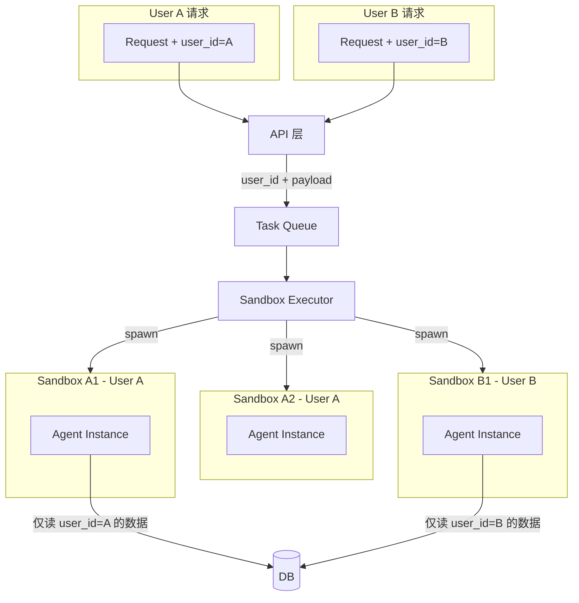

# Agent 沙箱与多租户隔离架构

> 按请求的临时沙箱执行模型，结合数据隔离（user_id 全程传递）和运行时隔离（每请求独立沙箱，用户间不共享）。

---

## 一、目标架构



**核心约束**：

1. 每次 Agent 调用 = 新建沙箱，执行完毕即销毁
2. 沙箱内仅能访问当前请求的 `user_id` 对应数据
3. 不同用户、不同请求的沙箱互不共享

---

## 二、沙箱执行模型

### 2.1 技术选型

| 方案 | 冷启动 | 隔离强度 | 适用场景 |
|------|--------|----------|----------|
| **Firecracker 微 VM** | ~125ms | 强 | 生产级多租户 |
| **gVisor (runsc)** | ~100ms | 强 | 容器级隔离 |
| **Docker `--read-only` + 网络隔离** | ~1s | 中 | 快速落地 |
| **Podman + rootless** | ~1s | 中 | 无 Daemon |

**建议**：MVP 使用 **Docker/containerd 单次 `docker run`**，每个 Agent 类型一个镜像，运行时传入 `user_id`、输入通过 stdin/env，输出通过 stdout。后续再替换为 Firecracker 或 gVisor。

### 2.2 Agent 调用流程

```
API 收到请求 (user_id 来自 JWT/session)
    → 校验 user_id 权限
    → 构造 Task { user_id, agent_type, payload }
    → 推入 Task Queue (Redis/RabbitMQ)
    → 返回 task_id (异步) 或等待 (同步，带超时)

Worker 拉取 Task
    → Executor.spawn(agent_type, user_id, payload)
        → docker run --rm -e USER_ID=$user_id \
            -e INPUT="$payload" vault-agent-recorder \
            (或 Firecracker 启动微 VM)
    → 容器内 Agent：仅能访问通过 env/stdin 传入的 user_id 和 payload
    → 容器需访问 DB 时：通过只读连接 + row-level security，或 Executor 注入临时 token
    → Agent 输出到 stdout → Executor 收集
    → 销毁沙箱
    → 回写结果到 Queue / 回调 API
```

### 2.3 Agent 与 DB 的隔离

沙箱内 Agent 需要读 DB 时，有两种方式：

**方案 A（推荐）**：沙箱不直连 DB，由 Executor 通过 RPC 代理

- Executor 在宿主机，持有 DB 连接
- Agent 通过 stdin 传入「需要的数据」（或 Executor 先按 user_id 查出，再注入）
- Agent 无网络、无 DB 连接，只做纯计算

**方案 B**：沙箱内给受限 DB 连接

- 使用 PostgreSQL Row-Level Security (RLS)：每个连接 `SET row_security = on` 且 `SET app.user_id = $user_id`
- 表上策略：`USING (user_id = current_setting('app.user_id'))`
- Agent 容器网络仅能访问 DB，不能访问其他服务

---

## 三、多租户数据模型

### 3.1 Schema 变更

`backend/app/db.py` 中所有业务表增加 `user_id`：

| 表 | 变更 |
|----|------|
| `trades` | 新增 `user_id`（或通过 `portfolio_id` → `portfolios.user_id` 间接） |
| `reviews` | 新增 `user_id` |
| `checklist` | 新增 `user_id` |
| `portfolios`（若引入） | 已有 `user_id` |

所有查询必须带 `user_id` 过滤；Agent 接收的 `payload` 中必须包含 `user_id`，且 Executor 不会向沙箱传入其他用户数据。

### 3.2 请求链路中的 user_id

```
Client (JWT) 
  → API middleware 解析 user_id
  → 所有 routers 的 handler 从 Depends(get_current_user) 获取 user_id
  → 调用 agents 时显式传入 user_id
  → Task 写入 Queue 时包含 user_id
  → Worker/Executor 启动沙箱时注入 user_id (env)
  → Agent 内所有逻辑仅使用该 user_id
```

---

## 四、目录与部署结构

### 4.1 代码目录

```
backend/
├── app/                          # FastAPI API（现有）
│   └── ...
│
├── agents/                       # Agent 源代码（可独立打包成镜像）
│   ├── __init__.py
│   ├── protocol.py               # StyleAnalyzer, AgentMessage, 统一 I/O 约定
│   ├── orchestrator/
│   ├── recorder/
│   ├── analyzer/
│   │   ├── hub.py
│   │   ├── base.py
│   │   └── styles/
│   └── reporter/
│
├── agent_runtime/                # 沙箱调度层
│   ├── __init__.py
│   ├── executor.py               # SandboxExecutor：spawn/destroy 沙箱
│   ├── queue.py                  # Task 定义、入队/出队
│   └── docker/                   # 各 Agent 的 Dockerfile
│       ├── Dockerfile.orchestrator
│       ├── Dockerfile.recorder
│       ├── Dockerfile.analyzer
│       └── Dockerfile.reporter
│
└── docker-compose.yml
```

### 4.2 Agent 镜像与沙箱约定

每个 Agent 镜像统一约定：

- **输入**：环境变量 `USER_ID`、`TASK_ID`，JSON payload 通过 `stdin`
- **输出**：JSON 结果写到 `stdout`
- **无网络**（或仅可访问 DB，若采用方案 B）：通过 `--network=none` 或 Firecracker 默认无网络实现
- **只读文件系统**：`docker run --read-only`（除必要 tmpfs）

### 4.3 Docker Compose 服务拆分

```yaml
services:
  postgres: ...
  api: ...                    # FastAPI，负责接收请求、入队

  redis: ...                  # Task Queue

  executor:                   # 沙箱执行器（常驻 Worker）
    image: vault-executor
    # 负责：拉 Task → spawn 对应 Agent 镜像 → 收结果 → 销毁
    depends_on: [redis]
```

Agent 不作为常驻服务，而是由 Executor 按需 `docker run` 启动。

---

## 五、MVP 落地顺序

| 阶段 | 内容 |
|------|------|
| 1 | Schema 增加 `user_id`；API 增加 `get_current_user` 依赖；所有路由强制带 user_id |
| 2 | 创建 `agents/` 目录和 `agent_runtime/` 骨架；定义 Protocol 与 I/O 约定 |
| 3 | 实现 `SandboxExecutor`，先基于 `docker run` 单 Agent（如 Recorder）做端到端验证 |
| 4 | 接入 Task Queue，支持异步调用 |
| 5 | 实现 DB 行级过滤（RLS 或应用层强制 user_id）；或采用方案 A，由 Executor 代理数据 |
| 6 | 逐步迁移到 Firecracker/gVisor（按需） |
